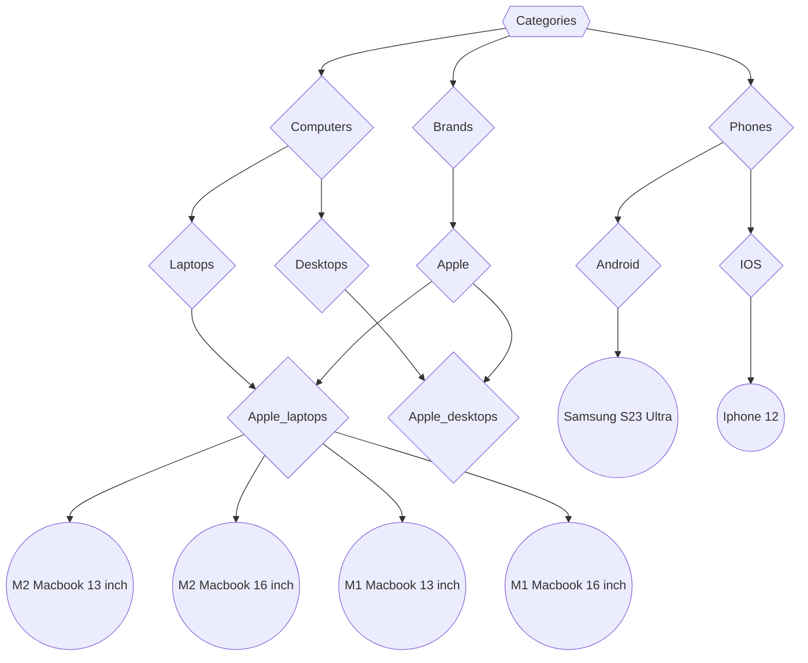

# Taxonomies

A repository demonstrating taxonomies, it is meant to accompany [this article](https://schulichignite.com/blog/taxonomical-ordering/).

## Taxonomy structure

## Files

`taxonomies.py`; A file that defines the taxonomies

`simple_example.py`; A file you can run to test the taxonomies

`web_example.py`; A file that shows a more practical use case for taxonomies. Requires you to install jinja `pip install jinja`
